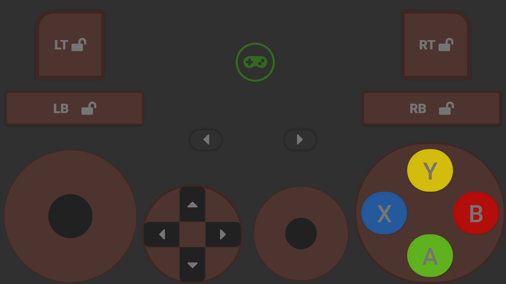
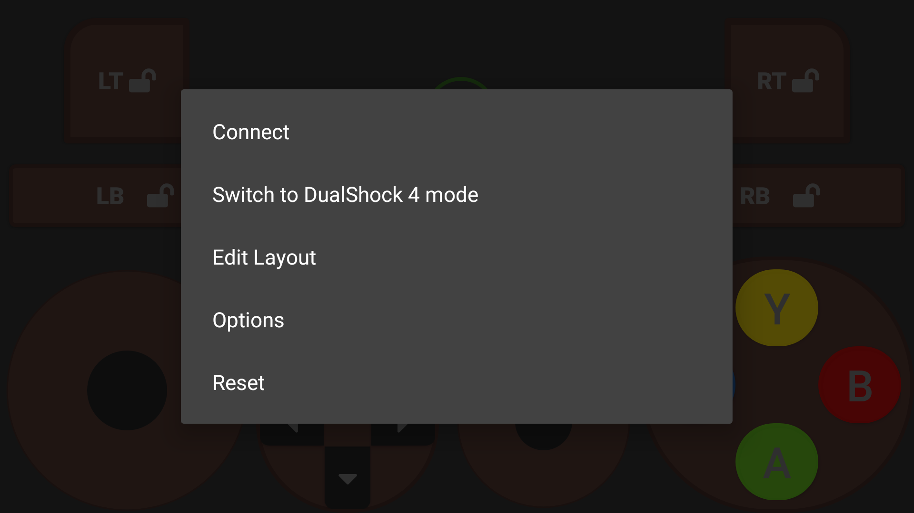
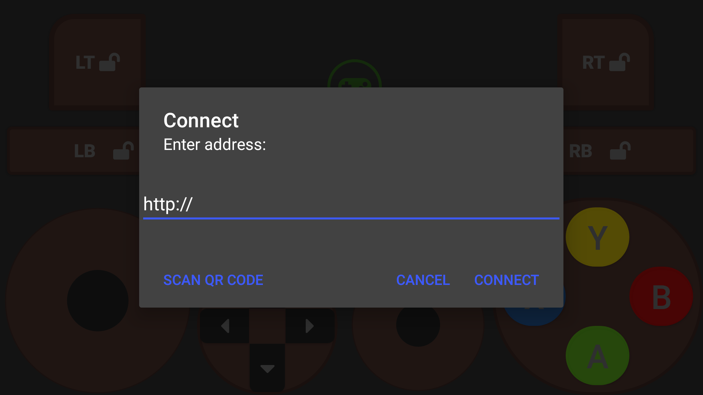
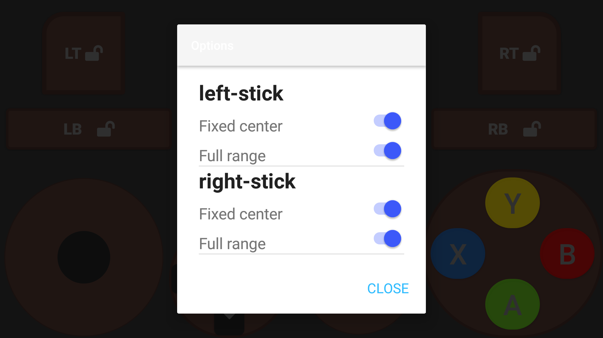

# Joy2DroidX

Use your phone as a virtual gamepad on your PC. Supported modes for gamepad are
Xbox 360 controller and DualShock 4. Supported platforms for server are Windows
and Linux.

### Server

Server can be downloaded [here](https://github.com/OzymandiasTheGreat/Joy2DroidX-server).
There you'll also find setup instructions (basically download and run).

### Client

The Android client (this app) runs on pretty much any Android device, the apk
is a bit big-ish but system requirements are minimal.

#### The buttons

On startup you're presented with a screen with a lot of buttons. If you ever held a physical gamepad this should
be self-explanatory.

In Xbox 360 controller mode all buttons are supported. In DualShock 4 mode every button except touchpad is supported.

The gamepad (main) button maps to guide/xbox/ps button.
It also serves as the main menu trigger for the app.
To open main menu long tap the gamepad button.

Double tapping sticks functions like pressing down physical sticks on physical controllers.

Another thing that needs mention is that triggers and bumpers support locking. Since they're meant to be held
down with index fingers while you play and this doesn't really work on a touchscreen, you can double tap them to enable locking. In locking mode tapping a button once
will keep it pressed until you tap it again. You can
lock-on to targets or whatever without having to perform
finger gymnastics!

#### The menu

##### Connect

Just enter your PC's IP address and port (default is 8013) and you're good to go.

Better yet, save yourself some typing and just scan the QRCode presented by the server and hit connect.

##### Layout editing

In edit mode there are additional gestures.

- Tapping and dragging (panning) allows you to rearrange controls and buttons.
- Pinching allows you to resize controls and buttons.
- Long tap hides controls and buttons.
- To show a hidden control or button long tap empty space
and you'll be presented with menu showing hidden controls.
- To reset a control double tap it.

Then from the main menu you can save your new custom layout. To cancel editing without saving just press back button.

##### Options

Unsetting fixed center will make stick center auto-calculated based on where you touched down.

Unsetting full range will make stick function sort of like buttons. They'll just have neutral and pressed states (max-range).

##### Reset

Reset from the main menu will reset all of your changes and restart the app.

Don't worry, it didn't crash, it's just reloading.

## Installation

You can grab a signed apk from releases page, or you can buy it on Google Play (pending review).

I'll also try to make it available on F-Droid.
